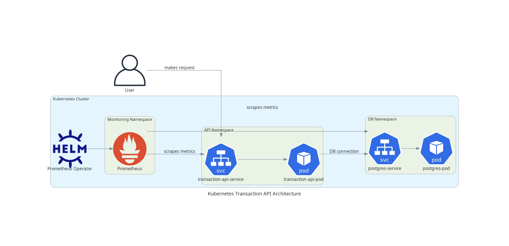

# Transaction API - Proof of Concept

This project is a simple proof-of-concept demonstrating:

1. A Golang API that stores transactions in Postgres.  
2. Deployment to Kubernetes using Docker containers.  
3. Basic monitoring and CI/CD workflows.

## Features
- Minimal REST API endpoint:
  - `POST /api/transaction` -> inserts a new transaction into the database.
- Containerized with multi-stage Docker build.
- Kubernetes manifests for deploying the API and Postgres.
- Example GitHub Actions workflow for CI/CD.

## Prerequisites
- Docker
- Kubernetes cluster (e.g., Minikube, KIND, or a cloud-managed service)
- Kubectl
- (Optionally) GitHub Actions set up for CI/CD


## Architecture Diagram



## Quickstart (Local)
1. Clone this repository:  
   ```bash
   git clone https://github.com/ronandoolan2/go-api-service.git
2. Create cluster:
   ```bash
   kind create cluster
3. Build container
   ```bash
   docker build -t ronandoolan/transaction-api:latest -f build/Dockerfile.api .
   docker push ronandoolan/transaction-api:latest
4. Setup monitoring
   helm repo add prometheus-community https://prometheus-community.github.io/helm-charts
   helm repo update
   helm install prometheus-operator prometheus-community/kube-prometheus-stack \
     --namespace monitoring --create-namespace
5. Deploy api stack
   kubectl apply -f deploy/ 
